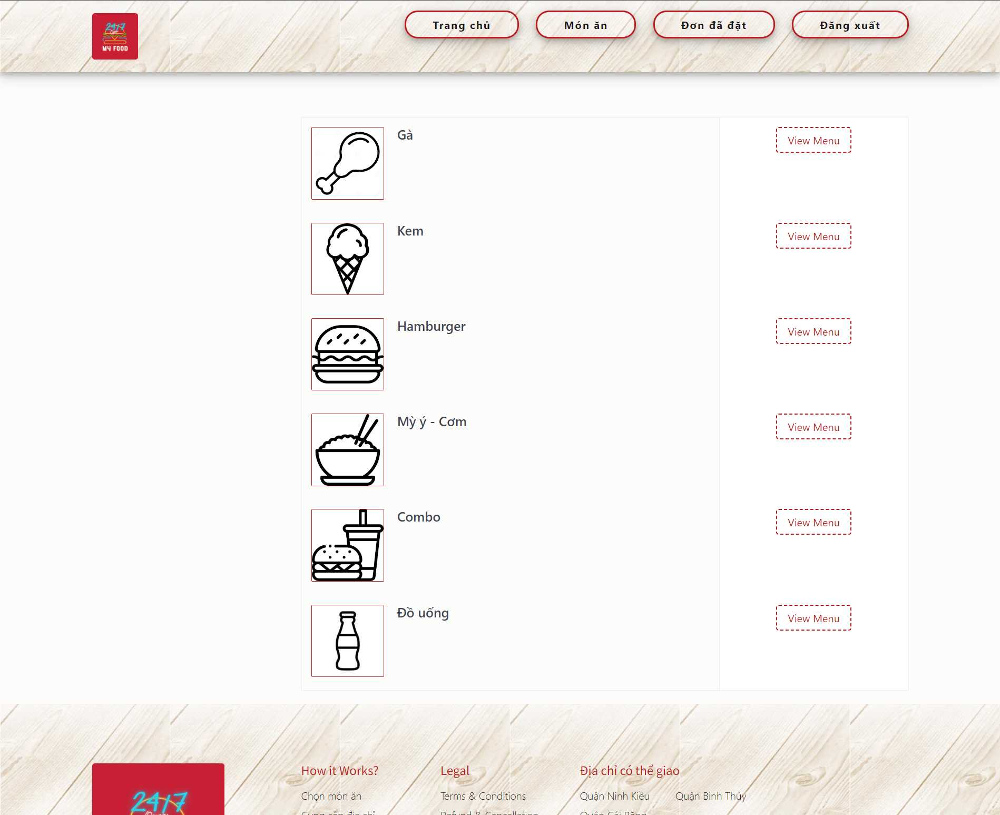

# MY FOOD WEBSITE

CRUD Food, Category. User. Support users to view, add food to cart and checkout. Admin users can view users, add users, view invoices, print invoices

## Prerequisite

Must have basic knowledge of HTML, CSS, JS, PHP and MySQL.
Install XAMPP

## Setting

1. Clone repository
2. Copy project folder into xampp/htdocs
3. At phpmyadmin, create a new database with name "foodpicky_db"
4. Import Database/foodpicky_db2.sql file into foodpicky_db database

## Running the app

1. Open XAMPP Control Panel
2. Start the Apache module and MySQL module
3. Go to [This](http://localhost/MYFOOD/) in browser for user
4. Go to [This URL](http://localhost/MYFOOD/admin) in browser for admin user

## Demo

### Login

### Sign up

### Home page

### Category List

### Product List

### Order List

### Admin dashboard

